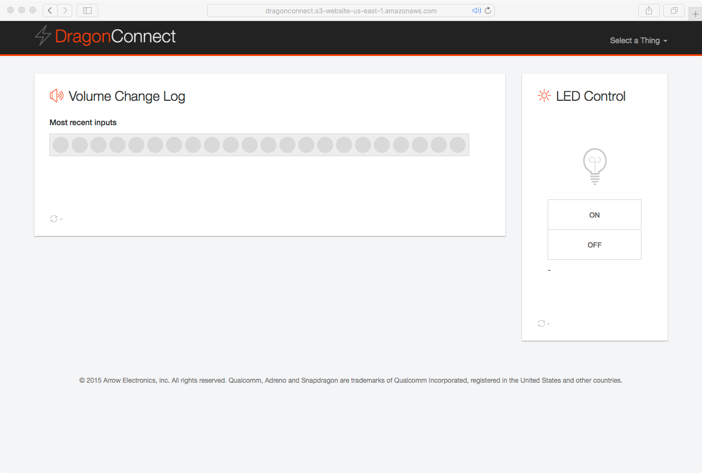

# Visit the Dashboard

Following the previous steps should have the client sending data to
Amazon Web Services and the dashboard displaying those data.  The dashboard
will be available at

http://dragonconnect-${identifier}.s3-website-${region}.amazonaws.com

where the identifier was defined when the
[Dashboard](./../admin/dashboard.html) was created.

Visiting the dashboard should display an image similar to

# Volume Change Log

The _Volume Change Log_ will display representations of the volume up or
volume down button being pressed.  When the volume up button is pressed
an image similar to the following is displayed

When the volume down button is pressed an image similar to the following is
displayed

# LED Management

The state of the LED may be managed through the dashboard by selecting the
appropriate state.  The state of the LED is reflected through the icon.

## Active LED

If the LED is active, the icon will look similar to

When the LED is active, the web site will allow you to inactive the LED by
pressing the "OFF" button.

## Inactive LED

If the LED is inactive, the icon will look similar to

When the LED is inactive, the web site will allow you to activate the LED by
pressing the "ON" button.
