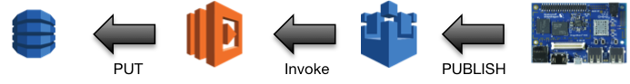

# Introduction

The DragonConnect example will collect and display audio events.

## Audio Event Storage

When the volume up button or the volume down button is pressed, the client
application records and stores the event according to the diagram

The following steps occur when the volume up or volume down button is pressed

1.  The volume up or volume down button is pressed.
2.  The DragonConnect client application intercepts the event and transmits
    the event to the things/+/audio/events topic using MQTT
3.  The DragonConnect-audioEvents Lambda function is invoked when a message
    is received on the things/+/audio/events topic
4.  The DragonConnect-audioEvents Lambda function stores the event in the
    DragonConnect-audioEvents DynamoDB table

## Audio Event Presentation

The dashboard will retrieve and display the _Volume Change Log_.  The
dashboard polls the DragonConnect API periodically and performs the following
steps

1.  The web browser makes a request of the /things/{thingId}/audio/events
    resource
2.  The API Gateway, when a request is received, invokes the
    DragonConnect-audioEvents Lambda function
3.  The DragonConnec-audioEvents Lambda function queries the
    DragonConnect-audioEvents table for the most recent events.  The number
    of events retrieved is specified by the limit query parameter and defaults,
    if not specified, to 10
4.  The web browser interprets the response and displays the appropriate
    event
